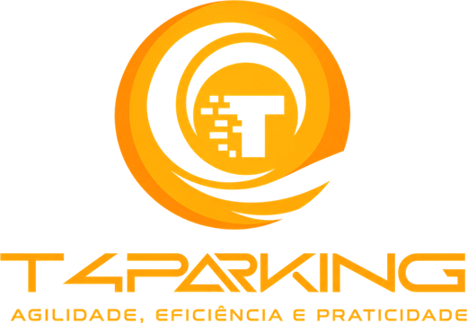

<p align="center">
  
</p>

<h1 align="center">
  Tech4Parking · Infra
</h1>

<p align="center">
  
</p>

<p align="center">
  <a href="https://skillicons.dev">
    
  </a>
</p>

## Qual a finalidade do projeto?

Infraestrutura como código do **Tech4Parking** (VagasAService) na **AWS**, escrita em **Terraform** e organizada em módulos por área: rede, computação, aplicação, entrega de conteúdo, identidade, dados, IoT e serviços.

Um único `terraform apply` cria tudo o que o sistema precisa: a VPC com subnets públicas e privadas, o site no **ECS Fargate** atrás de um **Application Load Balancer**, o domínio no **Route 53** com certificado do **ACM**, a **Lambda** de vagas com a **API Gateway** e a tabela **DynamoDB**, e a integração com os sensores pelo **AWS IoT Core**.

## O que foi construído

### Módulos

| Módulo | Recursos principais |
|---|---|
| `network` | VPC `10.0.0.0/16`, 2 subnets públicas e 2 privadas (us-east-1a/b), Internet Gateway, NAT Gateway, route tables e NACL |
| `compute` | Application Load Balancers e security groups |
| `application` | Clusters ECS (site e API) |
| `services/website` | ECR, task definition, serviço ECS Fargate (2 tasks, porta 3000), target group, listeners e autoscaling |
| `content-delivery` | Zona `vagasaservice.com.br` no Route 53, certificado ACM e validação por DNS |
| `services/lambda/process_car_parking` | Lambda (imagem no ECR), API Gateway `/spots` (GET, POST, DELETE, OPTIONS) e SNS |
| `database` | DynamoDB `ParkingSpots` (chave `spot_id`), `Transactions` e `Users` |
| `internet-of-things` | Thing, certificado e policy do sensor, regra IoT do tópico `parking_sensor` e permissão para invocar a Lambda |
| `identity-compliance` | Roles IAM (ECS, Lambda, API Gateway, logs do LB), chave KMS e políticas de bucket |
| `storage` | Buckets S3 (site e logs do load balancer) |
| `management-governance` | Log groups no CloudWatch |

### Variáveis principais

| Variável | Padrão |
|---|---|
| `aws_region` | `us-east-1` |
| `vpc_cidr` | `10.0.0.0/16` |
| `public_subnet_cidrs` | `10.0.1.0/24`, `10.0.2.0/24` |
| `private_subnet_cidrs` | `10.0.3.0/24`, `10.0.4.0/24` |
| `availability_zones` | `us-east-1a`, `us-east-1b` |
| `ecs_website_service_name` | `vagasaservice-website` |
| `environment` | `prod` |

## Tecnologias utilizadas

- **Terraform:** infraestrutura como código, com módulos por área;
- **Amazon VPC:** rede com subnets públicas e privadas em duas AZs;
- **Amazon ECS Fargate + ALB:** execução do site Next.js;
- **Amazon Route 53 + ACM:** domínio e HTTPS;
- **AWS Lambda + API Gateway:** API de vagas;
- **Amazon DynamoDB:** dados das vagas;
- **AWS IoT Core:** entrada dos sensores;
- **Amazon ECR:** imagens Docker do site e da Lambda;
- **IAM, KMS, S3 e CloudWatch:** segurança, armazenamento e logs.

## Estrutura do repositório

```text
tech4parking-infra/
├── terraform/
│   ├── provider.tf              # Provider AWS
│   ├── variables.tf             # Variáveis e valores padrão
│   ├── modules.tf               # Composição dos módulos
│   └── modules/                 # network, compute, application, database, services...
├── docs/
│   ├── arch.gif                 # Diagrama da arquitetura
│   └── logo.png                 # Logo T4Parking
└── README.md
```

## Fluxo de funcionamento

1. O `network` cria a VPC, as subnets, o Internet Gateway e o NAT Gateway.
2. O `content-delivery` cria a zona do Route 53 e o certificado HTTPS no ACM.
3. O `compute` e o `services/website` sobem o load balancer e o serviço ECS Fargate do site.
4. O `database` cria a tabela `ParkingSpots` e o `identity-compliance` dá à Lambda acesso a ela.
5. O `services/lambda/process_car_parking` cria a Lambda, o ECR da imagem e a API Gateway `/spots`.
6. O `internet-of-things` registra o sensor e liga a regra `parking_sensor` à Lambda.
7. As imagens do site e da Lambda são publicadas no ECR pelos repositórios de aplicação.

## Como usar

```bash
cd terraform
terraform init
terraform validate
terraform plan
terraform apply
```

Valores sensíveis ficam em `*.tfvars` (ignorados pelo git). Planos (`tfplan`) também não são versionados.

## Como validar a entrega

Em uma validação end-to-end, o `terraform apply` deve criar a infraestrutura completa e o site deve responder pelo domínio, com a API e o IoT integrados à Lambda.

Pontos principais de validação:

- `terraform validate` sem erros e `terraform plan` sem falhas;
- VPC com 2 subnets públicas, 2 privadas, Internet Gateway e NAT Gateway;
- serviço ECS Fargate com 2 tasks saudáveis no target group do ALB;
- domínio no Route 53 com certificado ACM validado;
- API Gateway `/spots` invocando a Lambda, com a tabela `ParkingSpots` criada;
- regra IoT `parking_sensor` ativa e com permissão para invocar a Lambda.

## Projeto Tech4Parking

| Repositório | Camada |
|---|---|
| [tech4parking-front](https://github.com/tech4parking-org/tech4parking-front) | Web app (Next.js) |
| [tech4parking-back](https://github.com/tech4parking-org/tech4parking-back) | Lambda de vagas (sensor + API) |
| **tech4parking-infra** | Infraestrutura AWS (Terraform) |
| [tech4parking-iot](https://github.com/tech4parking-org/tech4parking-iot) | Firmware do sensor (ESP32) |

## Autor

**William Alves Coelho** · [@willtechdev](https://github.com/willtechdev)
